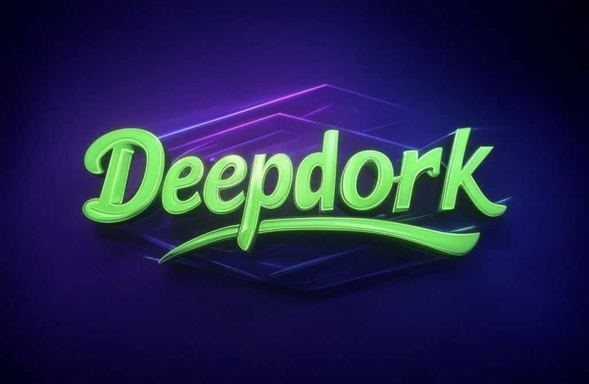

# DeepDork - The Ultimate Search Engine 🚀

## [Visit DeepDork](https:///h4xx00r.github.io/deepdork/)

## 🔍 Introduction
**DeepDork** is a powerful reconnaissance tool designed for **Google dorking & GitHub dorking** for security researchers, penetration testers, and ethical hackers. DeepDork uses search engine like Google and Github for information gathering, making it effortless to uncover sensitive data and code leaks. Level up dorking with this efficient manual technique—apply custom dorks or experiment with new default keywords.

## ⚡ Summary
- **Web-Based Platform** – Access DeepDork through a fully functional website.
- **Google Dorks** – Generate advanced search queries for **Google-based reconnaissance**.
- **GitHub Dorks** – Hunt for exposed credentials & security flaws in public repositories.
- **Custom Queries** – Easily tweak and refine searches to fit your research needs.

💡 Whether you're a **bug bounty hunter, OSINT investigator, or cybersecurity professional**, DeepDork helps you **find what others can't**.

🔗 **Check it out** and level up your dorking game!

### `Access Link` - https:///h4xx00r.github.io/deepdork

## Usage ✈️

### [Follow on Twitter](https://x.com//h4xx00r)

